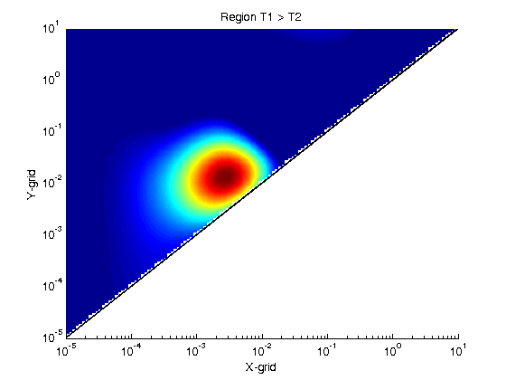
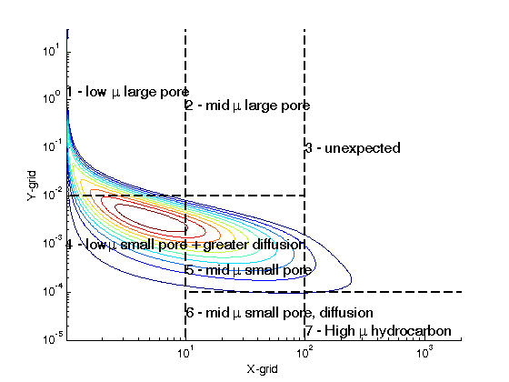
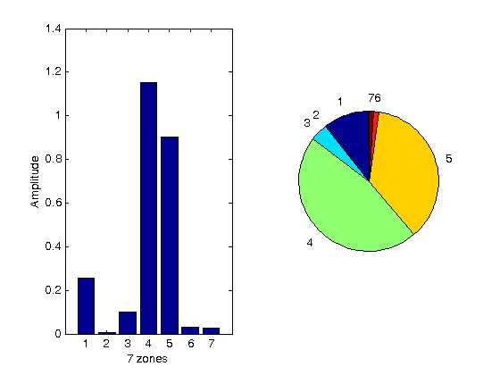

# NMR_to_RTs
Nuclear magnetic resonance(NMR) measurements can quantify different type of fluid volume distribution in shale in term of T_1 and T_2. However, it is hard to seperate fluids as decision boundaries of different fluids are nonlinear.[@Daigle (2014)] define two new parameters R and T_s. By expressing T_2,T_1 in term of the new parameters, volume distribution F(T_2,T_1) can be mapped to volume distribution G(R,Ts). In the new distribution, decision boundaries become linear. 

This program is written in Matlab. 
      
## Quick Start
Download the entire folders using git, run the test_main.m  

## Basic function
```
solution = Class_Conv_RTs();
solution.fit(T2_domain, T1_domain, F_volume_grid); 
solution.check_R_Ts_range()
solution.transform(opts_transform);

```


## How does this works?

The T1T2 distribution is display below. 
 


Convert this distribution to R,Ts distribution.



Calculate the volume in 7 zones. 



### References:
* [@Daigle_(2014)]:http://library.seg.org/doi/pdf/10.15530/urtec-2014-1905272

